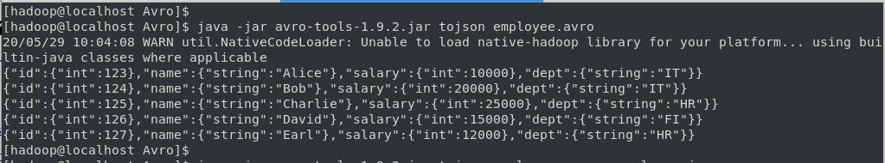
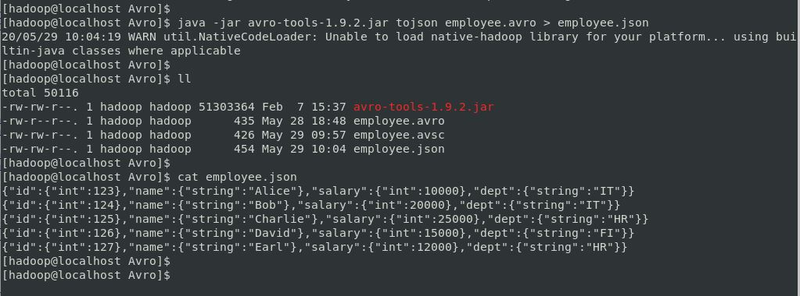
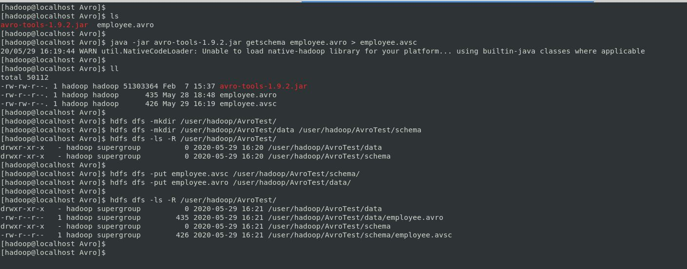

# HOW TO READ THE DATA FROM AN AVRO DATA FILE ?

This is a very big question that many people have and don't know to how to read an Avro Data File.

Reading an *AVRO* Data File is not easy to task. It is a special file format which cannot read as a normal text file, but there are different ways of reading an Avro data file and we are going to 3 of them which are more popular.

For example, if we have an employee file in AVRO file format. We'll try read it as a normal way and see what happens.

```
[hadoop@localhost Avro]$ 
[hadoop@localhost Avro]$ pwd
/home/hadoop/Downloads/Avro
[hadoop@localhost Avro]$ 
[hadoop@localhost Avro]$ ls
employee.avro
[hadoop@localhost Avro]$ 
[hadoop@localhost Avro]$ cat employee.avro 
Objavro.schema�{"type":"record","name":"employee_avro","namespace":"test_db","fields":[{"name":"id","type":["null","int"],"default":null},{"name":"name","type":["null","string"],"default":null},{"name":"salary","[;��\�TϬH�l","int"],"default":null},{"name":"dept","type":["null","string"],"default":null}]}
��
Alice��IT�Bob��IT�CharlieІHR�
[;��\�TϬH�[hadoop@localhost Avro]$ 
[hadoop@localhost Avro]$
```


Oh no! what was that? What am I looking at? Is that the data I'm looking for?


Yes, this is not the data we are interested in. We need to find out a way to read this data as we see the data from normal text files. There are multiple ways of reading the data from AVRO data file and here we are going to see the 3 most popular ways.

Before we start reading the data from the Avro file, let's have a look at what is **Apache AVRO?**

***Apache AVRO***:

Apache Avro™, instead of calling it as a file format, we call that as a ***data serialization system.***


*Avro provides:*

1. Rich data structures.
2. A compact, fast, binary data format.
3. A container file, to store persistent data.
4. Remote procedure call (RPC).
5. Simple integration with dynamic languages. Code generation is not required to read or write data files nor to use or implement RPC protocols. Code generation as an optional optimization, only worth implementing for statically typed languages.

***Schemas:***

Avro relies on schemas. When Avro data is read, the schema used when writing it is always present. This permits each datum to be written with no per-value overheads, making serialization both fast and small. This also facilitates use with dynamic, scripting languages, since data, together with its schema, is fully self-describing.

When Avro data is stored in a file, its schema is stored with it, so that files may be processed later by any program. If the program reading the data expects a different schema this can be easily resolved, since both schemas are present.

Avro schemas are defined with JSON . This facilitates implementation in languages that already have JSON libraries.

***Schema Evolution:***

Schema evolution is the term used for how the store behaves when Avro schema is changed after data has been written to the store using an older version of that schema.

***Comparison with other systems:***

Avro provides functionality similar to systems such as Thrift, Protocol Buffers, etc. Avro differs from these systems in the following fundamental aspects.

**Dynamic typing:** 

Avro does not require that code be generated. Data is always accompanied by a schema that permits full processing of that data without code generation, static datatypes, etc. This facilitates construction of generic data-processing systems and languages.

**Untagged data:**

Since the schema is present when data is read, considerably less type information need be encoded with data, resulting in smaller serialization size.

**No manually-assigned field IDs:**

When a schema changes, both the old and new schema are always present when processing data, so differences may be resolved symbolically, using field names.
Apache Avro, Avro, Apache, and the Avro and Apache logos are trademarks of The Apache Software Foundation.

***1. Using Apache Avro Tools Library:***
---

*Pre-requisites:*

* Install Java 1.8 +
* Set JAVA_HOME & add bin folder to CLASSPATH
* Avro-tools library (download from here)

```
[hadoop@localhost Avro]$ 
[hadoop@localhost Avro]$ echo $JAVA_HOME
/usr/lib/jvm/java-1.8.0-openjdk-1.8.0.242.b08-0.el7_7.x86_64
[hadoop@localhost Avro]$ 
[hadoop@localhost Avro]$ echo $PATH
/usr/local/bin:/usr/local/sbin:/usr/bin:/usr/sbin:/bin:/sbin:/usr/lib/jvm/java-1.8.0-openjdk-1.8.0.242.b08-0.el7_7.x86_64/bin:
/usr/local/hadoop-2.9.2/bin:/usr/local/hadoop-2.9.2/sbin:/usr/local/apache-hive-2.3.6-bin/bin:/usr/local/spark-2.4.4-bin-hadoop2.7/bin:
/usr/local/sqoop-1.4.7.bin__hadoop-2.6.0/bin:/usr/local/apache-maven-3.6.3/bin:/usr/local/pig-0.16.0/bin:/home/hadoop/.local/bin:/home/hadoop/bin
[hadoop@localhost Avro]$ 
[hadoop@localhost Avro]$ java -version
openjdk version "1.8.0_242"
OpenJDK Runtime Environment (build 1.8.0_242-b08)
OpenJDK 64-Bit Server VM (build 25.242-b08, mixed mode)
[hadoop@localhost Avro]$ 
[hadoop@localhost Avro]$ wget https://mirrors.estointernet.in/apache/avro/avro-1.9.2/java/avro-tools-1.9.2.jar
--2020-05-29 09:50:24--  https://mirrors.estointernet.in/apache/avro/avro-1.9.2/java/avro-tools-1.9.2.jar
Resolving mirrors.estointernet.in (mirrors.estointernet.in)... 103.97.84.254, 2403:8940:2::f
Connecting to mirrors.estointernet.in (mirrors.estointernet.in)|103.97.84.254|:443... connected.
HTTP request sent, awaiting response... 200 OK
Length: 51303364 (49M) [application/java-archive]
Saving to: ‘avro-tools-1.9.2.jar’

100%[=======================================================================>] 51,303,364  1.20MB/s   in 41s    

2020-05-29 09:51:05 (1.20 MB/s) - ‘avro-tools-1.9.2.jar’ saved [51303364/51303364]

[hadoop@localhost Avro]$ ll
total 50108
-rw-rw-r--. 1 hadoop hadoop 51303364 Feb  7 15:37 avro-tools-1.9.2.jar
-rw-r--r--. 1 hadoop hadoop      435 May 28 18:48 employee.avro
[hadoop@localhost Avro]$ 
```


*Avro Tools Help:*

```
[hadoop@localhost Avro]$ 
[hadoop@localhost Avro]$ java -jar avro-tools-1.9.2.jar
Version 1.9.2
 of Apache Avro
Copyright 2010-2015 The Apache Software Foundation

This product includes software developed at
The Apache Software Foundation (https://www.apache.org/).
----------------
Available tools:
    canonical  Converts an Avro Schema to its canonical form
          cat  Extracts samples from files
      compile  Generates Java code for the given schema.
       concat  Concatenates avro files without re-compressing.
  fingerprint  Returns the fingerprint for the schemas.
   fragtojson  Renders a binary-encoded Avro datum as JSON.
     fromjson  Reads JSON records and writes an Avro data file.
     fromtext  Imports a text file into an avro data file.
      getmeta  Prints out the metadata of an Avro data file.
    getschema  Prints out schema of an Avro data file.
          idl  Generates a JSON schema from an Avro IDL file
 idl2schemata  Extract JSON schemata of the types from an Avro IDL file
       induce  Induce schema/protocol from Java class/interface via reflection.
   jsontofrag  Renders a JSON-encoded Avro datum as binary.
       random  Creates a file with randomly generated instances of a schema.
      recodec  Alters the codec of a data file.
       repair  Recovers data from a corrupt Avro Data file
  rpcprotocol  Output the protocol of a RPC service
   rpcreceive  Opens an RPC Server and listens for one message.
      rpcsend  Sends a single RPC message.
       tether  Run a tethered mapreduce job.
       tojson  Dumps an Avro data file as JSON, record per line or pretty.
       totext  Converts an Avro data file to a text file.
     totrevni  Converts an Avro data file to a Trevni file.
  trevni_meta  Dumps a Trevni file's metadata as JSON.
trevni_random  Create a Trevni file filled with random instances of a schema.
trevni_tojson  Dumps a Trevni file as JSON.
[hadoop@localhost Avro]$
```


*Getting the schema from Avro File:*

```
[hadoop@localhost Avro]$ 
[hadoop@localhost Avro]$ java -jar avro-tools-1.9.2.jar getschema employee.avro 
20/05/29 09:56:47 WARN util.NativeCodeLoader: Unable to load native-hadoop library for your platform... using builtin-java classes where applicable
{
  "type" : "record",
  "name" : "employee_avro",
  "namespace" : "test_db",
  "fields" : [ {
    "name" : "id",
    "type" : [ "null", "int" ],
    "default" : null
  }, {
    "name" : "name",
    "type" : [ "null", "string" ],
    "default" : null
  }, {
    "name" : "salary",
    "type" : [ "null", "int" ],
    "default" : null
  }, {
    "name" : "dept",
    "type" : [ "null", "string" ],
    "default" : null
  } ]
}
[hadoop@localhost Avro]$
```


*Storing the Avro Schema to avsc file:*

```
[hadoop@localhost Avro]$ 
[hadoop@localhost Avro]$ java -jar avro-tools-1.9.2.jar getschema employee.avro > employee.avsc
20/05/29 09:57:40 WARN util.NativeCodeLoader: Unable to load native-hadoop library for your platform... using builtin-java classes where applicable
[hadoop@localhost Avro]$ 
[hadoop@localhost Avro]$ ll
total 50112
-rw-rw-r--. 1 hadoop hadoop 51303364 Feb  7 15:37 avro-tools-1.9.2.jar
-rw-r--r--. 1 hadoop hadoop      435 May 28 18:48 employee.avro
-rw-rw-r--. 1 hadoop hadoop      426 May 29 09:57 employee.avsc
[hadoop@localhost Avro]$ 
[hadoop@localhost Avro]$ cat employee.avsc 
{
  "type" : "record",
  "name" : "employee_avro",
  "namespace" : "test_db",
  "fields" : [ {
    "name" : "id",
    "type" : [ "null", "int" ],
    "default" : null
  }, {
    "name" : "name",
    "type" : [ "null", "string" ],
    "default" : null
  }, {
    "name" : "salary",
    "type" : [ "null", "int" ],
    "default" : null
  }, {
    "name" : "dept",
    "type" : [ "null", "string" ],
    "default" : null
  } ]
}
[hadoop@localhost Avro]$
```


*Reading Data From Avro File:*

```
[hadoop@localhost Avro]$ 
[hadoop@localhost Avro]$ java -jar avro-tools-1.9.2.jar tojson employee.avro 
20/05/29 10:04:08 WARN util.NativeCodeLoader: Unable to load native-hadoop library for your platform... using builtin-java classes where applicable
{"id":{"int":123},"name":{"string":"Alice"},"salary":{"int":10000},"dept":{"string":"IT"}}
{"id":{"int":124},"name":{"string":"Bob"},"salary":{"int":20000},"dept":{"string":"IT"}}
{"id":{"int":125},"name":{"string":"Charlie"},"salary":{"int":25000},"dept":{"string":"HR"}}
{"id":{"int":126},"name":{"string":"David"},"salary":{"int":15000},"dept":{"string":"FI"}}
{"id":{"int":127},"name":{"string":"Earl"},"salary":{"int":12000},"dept":{"string":"HR"}}
[hadoop@localhost Avro]$
```



*Reading Data and Save into json file:*

```
[hadoop@localhost Avro]$ 
[hadoop@localhost Avro]$ java -jar avro-tools-1.9.2.jar tojson employee.avro > employee.json
20/05/29 10:04:19 WARN util.NativeCodeLoader: Unable to load native-hadoop library for your platform... using builtin-java classes where applicable
[hadoop@localhost Avro]$ 
[hadoop@localhost Avro]$ ll
total 50116
-rw-rw-r--. 1 hadoop hadoop 51303364 Feb  7 15:37 avro-tools-1.9.2.jar
-rw-r--r--. 1 hadoop hadoop      435 May 28 18:48 employee.avro
-rw-rw-r--. 1 hadoop hadoop      426 May 29 09:57 employee.avsc
-rw-rw-r--. 1 hadoop hadoop      454 May 29 10:04 employee.json
[hadoop@localhost Avro]$ 
[hadoop@localhost Avro]$ cat employee.json 
{"id":{"int":123},"name":{"string":"Alice"},"salary":{"int":10000},"dept":{"string":"IT"}}
{"id":{"int":124},"name":{"string":"Bob"},"salary":{"int":20000},"dept":{"string":"IT"}}
{"id":{"int":125},"name":{"string":"Charlie"},"salary":{"int":25000},"dept":{"string":"HR"}}
{"id":{"int":126},"name":{"string":"David"},"salary":{"int":15000},"dept":{"string":"FI"}}
{"id":{"int":127},"name":{"string":"Earl"},"salary":{"int":12000},"dept":{"string":"HR"}}
[hadoop@localhost Avro]$
```



***2. Using Apache Spark:***
---
*Pre-requisites:*

* Install Java 1.8 +
* Set JAVA_HOME & add bin folder to CLASSPATH
* Install Apache Spark (2.4.1 or later)
* Set SPARK_HOME & add bin folder to CLASSPATH
* Spark Avro Library

```
[hadoop@localhost Avro]$ 
[hadoop@localhost Avro]$ echo $JAVA_HOME
/usr/lib/jvm/java-1.8.0-openjdk-1.8.0.242.b08-0.el7_7.x86_64
[hadoop@localhost Avro]$ 
[hadoop@localhost Avro]$ echo $SPARK_HOME
/usr/local/spark-2.4.4-bin-hadoop2.7
[hadoop@localhost Avro]$ 
[hadoop@localhost Avro]$ echo $PATH
/usr/local/bin:/usr/local/sbin:/usr/bin:/usr/sbin:/bin:/sbin:/usr/lib/jvm/java-1.8.0-openjdk-1.8.0.242.b08-0.el7_7.x86_64/bin:
/usr/local/hadoop-2.9.2/bin:/usr/local/hadoop-2.9.2/sbin:/usr/local/apache-hive-2.3.6-bin/bin:/usr/local/spark-2.4.4-bin-hadoop2.7/bin:
/usr/local/sqoop-1.4.7.bin__hadoop-2.6.0/bin:/usr/local/apache-maven-3.6.3/bin:/usr/local/pig-0.16.0/bin:/home/hadoop/.local/bin:/home/hadoop/bin
[hadoop@localhost Avro]$
[hadoop@localhost Avro]$ java -version
openjdk version "1.8.0_242"
OpenJDK Runtime Environment (build 1.8.0_242-b08)
OpenJDK 64-Bit Server VM (build 25.242-b08, mixed mode)
[hadoop@localhost Avro]$ 
[hadoop@localhost Avro]$ spark-shell --master local --packages org.apache.spark:spark-avro_2.11:2.4.4
Ivy Default Cache set to: /home/hadoop/.ivy2/cache
The jars for the packages stored in: /home/hadoop/.ivy2/jars
:: loading settings :: url = jar:file:/usr/local/spark-2.4.4-bin-hadoop2.7/jars/ivy-2.4.0.jar!/org/apache/ivy/core/settings/ivysettings.xml
org.apache.spark#spark-avro_2.11 added as a dependency
:: resolving dependencies :: org.apache.spark#spark-submit-parent-a10deaf7-bb71-43cf-b895-79d2f735d41b;1.0
	confs: [default]
	found org.apache.spark#spark-avro_2.11;2.4.4 in central
	found org.spark-project.spark#unused;1.0.0 in central
:: resolution report :: resolve 590ms :: artifacts dl 11ms
	:: modules in use:
	org.apache.spark#spark-avro_2.11;2.4.4 from central in [default]
	org.spark-project.spark#unused;1.0.0 from central in [default]
	---------------------------------------------------------------------
	|                  |            modules            ||   artifacts   |
	|       conf       | number| search|dwnlded|evicted|| number|dwnlded|
	---------------------------------------------------------------------
	|      default     |   2   |   0   |   0   |   0   ||   2   |   0   |
	---------------------------------------------------------------------
:: retrieving :: org.apache.spark#spark-submit-parent-a10deaf7-bb71-43cf-b895-79d2f735d41b
	confs: [default]
	0 artifacts copied, 2 already retrieved (0kB/10ms)
20/05/29 10:14:41 WARN util.Utils: Your hostname, localhost.localdomain resolves to a loopback address: 127.0.0.1; using 192.168.168.129 instead (on interface ens33)
20/05/29 10:14:41 WARN util.Utils: Set SPARK_LOCAL_IP if you need to bind to another address
20/05/29 10:14:52 WARN util.NativeCodeLoader: Unable to load native-hadoop library for your platform... using builtin-java classes where applicable
Setting default log level to "WARN".
To adjust logging level use sc.setLogLevel(newLevel). For SparkR, use setLogLevel(newLevel).
Spark context Web UI available at http://192.168.168.129:4040
Spark context available as 'sc' (master = local, app id = local-1590727507931).
Spark session available as 'spark'.
Welcome to
      ____              __
     / __/__  ___ _____/ /__
    _\ \/ _ \/ _ `/ __/  '_/
   /___/ .__/\_,_/_/ /_/\_\   version 2.4.4
      /_/
         
Using Scala version 2.11.12 (OpenJDK 64-Bit Server VM, Java 1.8.0_242)
Type in expressions to have them evaluated.
Type :help for more information.

scala>
```


*Reading Data Using Spark:*

```
Spark context Web UI available at http://192.168.168.129:4040
Spark context available as 'sc' (master = local, app id = local-1590727507931).
Spark session available as 'spark'.
Welcome to
      ____              __
     / __/__  ___ _____/ /__
    _\ \/ _ \/ _ `/ __/  '_/
   /___/ .__/\_,_/_/ /_/\_\   version 2.4.4
      /_/
         
Using Scala version 2.11.12 (OpenJDK 64-Bit Server VM, Java 1.8.0_242)
Type in expressions to have them evaluated.
Type :help for more information.

scala> 

scala> val df = spark.read.format("avro").load("file:///home/hadoop/Downloads/Avro/employee.avro")
df: org.apache.spark.sql.DataFrame = [id: int, name: string ... 2 more fields]

scala> df.show
+---+-------+------+----+                                                       
| id|   name|salary|dept|
+---+-------+------+----+
|123|  Alice| 10000|  IT|
|124|    Bob| 20000|  IT|
|125|Charlie| 25000|  HR|
|126|  David| 15000|  FI|
|127|   Earl| 12000|  HR|
+---+-------+------+----+


scala> df.printSchema
root
 |-- id: integer (nullable = true)
 |-- name: string (nullable = true)
 |-- salary: integer (nullable = true)
 |-- dept: string (nullable = true)


scala>
```


***3. Using Apache Hive:***
---

Reading the data from Avro Data File using Apache Hive will be helpful whenever we deal with some huge files.

*Pre-requisites:*

* Install Java 1.8 +
* Set JAVA_HOME & add bin folder to CLASSPATH
* Install Apache Hadoop & Apache Hive 1.x or later
* Avro Tools Library

*i. Using the Avro Schema (avsc) file:*

```
[hadoop@localhost Avro]$ 
[hadoop@localhost Avro]$ ls
avro-tools-1.9.2.jar  employee.avro
[hadoop@localhost Avro]$ 
[hadoop@localhost Avro]$ java -jar avro-tools-1.9.2.jar getschema employee.avro > employee.avsc
20/05/29 16:19:44 WARN util.NativeCodeLoader: Unable to load native-hadoop library for your platform... using builtin-java classes where applicable
[hadoop@localhost Avro]$ 
[hadoop@localhost Avro]$ ll
total 50112
-rw-rw-r--. 1 hadoop hadoop 51303364 Feb  7 15:37 avro-tools-1.9.2.jar
-rw-r--r--. 1 hadoop hadoop      435 May 28 18:48 employee.avro
-rw-rw-r--. 1 hadoop hadoop      426 May 29 16:19 employee.avsc
[hadoop@localhost Avro]$ 
[hadoop@localhost Avro]$ hdfs dfs -mkdir /user/hadoop/AvroTest/
[hadoop@localhost Avro]$ hdfs dfs -mkdir /user/hadoop/AvroTest/data /user/hadoop/AvroTest/schema
[hadoop@localhost Avro]$ hdfs dfs -ls -R /user/hadoop/AvroTest/
drwxr-xr-x   - hadoop supergroup          0 2020-05-29 16:20 /user/hadoop/AvroTest/data
drwxr-xr-x   - hadoop supergroup          0 2020-05-29 16:20 /user/hadoop/AvroTest/schema
[hadoop@localhost Avro]$ 
[hadoop@localhost Avro]$ hdfs dfs -put employee.avsc /user/hadoop/AvroTest/schema/
[hadoop@localhost Avro]$ hdfs dfs -put employee.avro /user/hadoop/AvroTest/data/
[hadoop@localhost Avro]$ 
[hadoop@localhost Avro]$ hdfs dfs -ls -R /user/hadoop/AvroTest/
drwxr-xr-x   - hadoop supergroup          0 2020-05-29 16:21 /user/hadoop/AvroTest/data
-rw-r--r--   1 hadoop supergroup        435 2020-05-29 16:21 /user/hadoop/AvroTest/data/employee.avro
drwxr-xr-x   - hadoop supergroup          0 2020-05-29 16:21 /user/hadoop/AvroTest/schema
-rw-r--r--   1 hadoop supergroup        426 2020-05-29 16:21 /user/hadoop/AvroTest/schema/employee.avsc
[hadoop@localhost Avro]$
[hadoop@localhost Avro]$ 
[hadoop@localhost Avro]$ beeline -u jdbc:hive2://localhost:10000/default
SLF4J: Class path contains multiple SLF4J bindings.
SLF4J: Found binding in [jar:file:/usr/local/apache-hive-2.3.6-bin/lib/log4j-slf4j-impl-2.6.2.jar!/org/slf4j/impl/StaticLoggerBinder.class]
SLF4J: Found binding in [jar:file:/usr/local/hadoop-2.9.2/share/hadoop/common/lib/slf4j-log4j12-1.7.25.jar!/org/slf4j/impl/StaticLoggerBinder.class]
SLF4J: See http://www.slf4j.org/codes.html#multiple_bindings for an explanation.
SLF4J: Actual binding is of type [org.apache.logging.slf4j.Log4jLoggerFactory]
Connecting to jdbc:hive2://localhost:10000/default
Connected to: Apache Hive (version 2.3.6)
Driver: Hive JDBC (version 2.3.6)
Transaction isolation: TRANSACTION_REPEATABLE_READ
Beeline version 2.3.6 by Apache Hive
0: jdbc:hive2://localhost:10000/default> 
0: jdbc:hive2://localhost:10000/default> 
0: jdbc:hive2://localhost:10000/default> create database avro_db;
No rows affected (3.42 seconds)
0: jdbc:hive2://localhost:10000/default> use avro_db;
No rows affected (0.169 seconds)
0: jdbc:hive2://localhost:10000/default> show tables;
+-----------+
| tab_name  |
+-----------+
+-----------+
No rows selected (0.619 seconds)
0: jdbc:hive2://localhost:10000/default> 
0: jdbc:hive2://localhost:10000/default> create external table employee_1_avro
. . . . . . . . . . . . . . . . . . . .> stored as avro
. . . . . . . . . . . . . . . . . . . .> location "hdfs:///user/hadoop/AvroTest/data/"
. . . . . . . . . . . . . . . . . . . .> tblproperties ("avro.schema.url"="/user/hadoop/AvroTest/schema/employee.avsc");
No rows affected (0.563 seconds)
0: jdbc:hive2://localhost:10000/default> select * from employee_1_avro;
+---------------------+-----------------------+-------------------------+-----------------------+
| employee_1_avro.id  | employee_1_avro.name  | employee_1_avro.salary  | employee_1_avro.dept  |
+---------------------+-----------------------+-------------------------+-----------------------+
| 123                 | Alice                 | 10000                   | IT                    |
| 124                 | Bob                   | 20000                   | IT                    |
| 125                 | Charlie               | 25000                   | HR                    |
| 126                 | David                 | 15000                   | FI                    |
| 127                 | Earl                  | 12000                   | HR                    |
+---------------------+-----------------------+-------------------------+-----------------------+
5 rows selected (3.01 seconds)
0: jdbc:hive2://localhost:10000/default> 
```




*ii. Using the Structure of the data:*

```
0: jdbc:hive2://localhost:10000/default> 
0: jdbc:hive2://localhost:10000/default> create external table employee_2_avro
. . . . . . . . . . . . . . . . . . . .> (id int, name string, salary int, dept string)
. . . . . . . . . . . . . . . . . . . .> stored as avro
. . . . . . . . . . . . . . . . . . . .> location "hdfs:///user/hadoop/AvroTest/data/";
No rows affected (0.324 seconds)
0: jdbc:hive2://localhost:10000/default> 
0: jdbc:hive2://localhost:10000/default> select * from employee_2_avro;
+---------------------+-----------------------+-------------------------+-----------------------+
| employee_2_avro.id  | employee_2_avro.name  | employee_2_avro.salary  | employee_2_avro.dept  |
+---------------------+-----------------------+-------------------------+-----------------------+
| 123                 | Alice                 | 10000                   | IT                    |
| 124                 | Bob                   | 20000                   | IT                    |
| 125                 | Charlie               | 25000                   | HR                    |
| 126                 | David                 | 15000                   | FI                    |
| 127                 | Earl                  | 12000                   | HR                    |
+---------------------+-----------------------+-------------------------+-----------------------+
5 rows selected (0.318 seconds)
0: jdbc:hive2://localhost:10000/default>
```


That's all. We are now able to read the data from an Avro Data File.

Hope this was helpful.

###***Cheers & Happy Coding...!!!***

References:

* https://www.oracle.com/in/java/technologies/javase/javase-jdk8-downloads.html
* https://avro.apache.org/docs/1.8.2/gettingstartedjava.html
* https://avro.apache.org/docs/1.8.2/index.html
* https://spark.apache.org/
* https://spark.apache.org/docs/latest/sql-data-sources-avro.html
* https://cwiki.apache.org/confluence/display/Hive/GettingStarted
