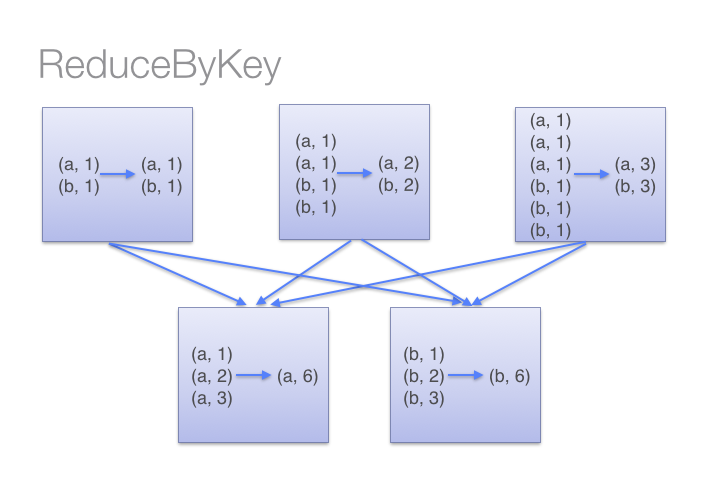

# SPARK BY KEY OPERATIONS

In this we'll cover 4 ByKey operations in Spark and all these transformations operates on Key Value Pairs(PairRDD).

	1. groupByKey		Lazy, Wide, Costly(Doesn't use combiner), Hash Partition
	2. reduceByKey		Lazy, Wide, Optimized, Input & Output DataType should be same
	3. aggregateByKey	Lazy, Wide, Optimizied, Expects Initial Value, Input & Output DataType can be different
	4. combineByKey		Lazy, Wide, Optimized, Expectes the Initial Function, Input & Output DataType can be different

## groupByKey

Spark RDD groupByKey function collects the values for each key in a form of an iterator. groupByKey function groups all values with respect to a single key data in the partitions and shuffled over the network to form a key and list of values.

	groupByKey()		- groups the values for each key in the RDD into a single sequence
	groupByKey(numTasks) 	- takes the number as an argument for tasks to execute to generate Output RDD
	groupByKey(partitioner)	- takes the partitioner function as an argument for creating partitions in output RDD


SYNTAX:

`pairRDD.groupByKey()`

EXAMPLE:

`pairRDD.groupByKey()`

## reduceByKey

Spark RDD reduceByKey function merges the values for each key using an associative reduce function (it should be Commutative and Associative in mathematical nature).
When called on a dataset of (K, V) pairs, returns a dataset of (K, V) pairs where the values for each key are aggregated using the given reduce function. The function should be able to take arguments of same type and it returns same result data type. Like in groupByKey, the number of reduce tasks is configurable through an optional second argument.

	reduceByKey(function)			- this produces hash-partitioned output with existing number of partitions / tasks
	reduceByKey(function, [numTasks])	- this produces hash-partitioned output with the given number of partitions / tasks
	reduceByKey(partitioner, function)	- this produces the output using the given Partitioner and the Reducer function.



SYNTAX:

`pairRDD.reduceByKey(reduceFunction)`

EXAMPLE:

```
pairRDD.reduceByKey((x, y) => x + y)
or
pairRDD.reduceByKey(_ + _)
```

## aggregateByKey

Spark aggregateByKey function aggregates the values of each key, using given combine functions and a neutral “zero value”. The aggregateByKey function aggregates values for each key and and returns a different type of value for that key. aggregateByKey function in Spark accepts total 3 parameters,

	  i. Initial value or Zero value
		- It can be 0 if aggregation is type of sum of all values
		- It can be Double.MaxValue if aggregation objective is to find minimum value
		- It can be Double.MinValue value if aggregation objective is to find maximum value
		- It can be an empty List or Map object, if we just want a respective collection as an output for each key
	 ii. Sequence operation function which transforms/merges data of one type [V] to another type [U]
	iii. Combination operation function which merges multiple transformed type [U] to a single type 


SYNTAX:

`pairRDD.aggregateByKey(InitalValue)(SequenceFunction, MergeFunction)`

EXAMPLE:

```
pairRDD.aggregateByKey(
  (0, 0)				 // InitalValue
  )(
    (x, y) => (x._1 + y, x._2 + 1), 	 // Sequence / MergeValue Function
    (x, y) => (x._1 + y._1, x._2 + y._2) // Merge Combiners Function
  )
```

## combineByKey

Spark combineByKey RDD transformation is very similar to combiner in Hadoop MapReduce programming. combineByKey transform any PairRDD[(K,V)] to the RDD[(K,C)] where C is the result of any aggregation of all values under key K.

Spark combineByKey takes 3 functions as arguments:

	createCombiner
	mergeValue
	mergeCombiners

#####   i. createCombiner function:
	It is a first aggregation step for each key
	It will be executed when any new key is found in a partition
	Execution of this lambda function is local to a partition of a node, on each individual values

#####  ii. mergeValue
	This function executes when next subsequent value is given to combiner
	It also executes locally on each partition of a node and combines all values
	Arguments of this function are a accumulator and a new value
	It combines a new value in existing accumulator

##### iii. mergeCombiner
	This is the final function used to merge two accumulators (i.e. combiners) of a single key across the partitions to generate final expected result
	Arguments are two accumulators (i.e. combiners)
	Merge results of a single key from different partitions


SYNTAX:

`pairRDD.combineByKey(createCombiner, mergeValue, mergeCombiners)`

EXAMPLE:

```
pairRDD.combineByKey(
    (x: Int) => (0, 0)							// Create Combiner Function
    (x: Int, y: Int) => (x._1 + y, x._2 + 1), 				// Merge Value Function
    (x: (Int, Int), y: (Int, Int)) => (x._1 + y._1, x._2 + y._2)	// Merge Combiners Function
  )
```

# WORD COUNT EXAMPLE:

Initial data setup
---

```
scala> val list = List(
     |   "hadoop hadoop spark",
     |   "kafka cassandra hbase",
     |   "hadoop hadoop spark",
     |   "kafka cassandra hbase hadoop hadoop spark hadoop hadoop spark",
     |   "hadoop hadoop spark",
     |   "kafka cassandra hbase",
     |   "hadoop hadoop spark",
     |   "kafka cassandra hbase hadoop hadoop spark hadoop hadoop spark",
     |   "hadoop hadoop spark",
     |   "kafka cassandra hbase",
     |   "hadoop hadoop spark",
     |   "kafka cassandra hbase",
     |   "hadoop hadoop spark hadoop hadoop spark",
     |   "kafka cassandra hbase",
     |   "kafka cassandra hbase"
     | )
list: List[String] = List(hadoop hadoop spark, kafka cassandra hbase, hadoop hadoop spark, kafka cassandra hbase hadoop hadoop spark hadoop hadoop spark, hadoop hadoop spark, kafka cassandra hbase, hadoop hadoop spark, kafka cassandra hbase hadoop hadoop spark hadoop hadoop spark, hadoop hadoop spark, kafka cassandra hbase, hadoop hadoop spark, kafka cassandra hbase, hadoop hadoop spark hadoop hadoop spark, kafka cassandra hbase, kafka cassandra hbase)
```

Parallelize RDD
---

```
scala> val rdd = sc.parallelize(list, 4)
rdd: org.apache.spark.rdd.RDD[String] = ParallelCollectionRDD[0] at parallelize at <console>:26
```

Print RDD
---

```
scala> rdd.collect.foreach(println)
hadoop hadoop spark
kafka cassandra hbase
hadoop hadoop spark
kafka cassandra hbase hadoop hadoop spark hadoop hadoop spark
hadoop hadoop spark
kafka cassandra hbase
hadoop hadoop spark
kafka cassandra hbase hadoop hadoop spark hadoop hadoop spark
hadoop hadoop spark
kafka cassandra hbase
hadoop hadoop spark
kafka cassandra hbase
hadoop hadoop spark hadoop hadoop spark
kafka cassandra hbase
kafka cassandra hbase
```


FlatMap and print RDD
---

```
scala> val words = rdd.flatMap(x => x.split(" "))
words: org.apache.spark.rdd.RDD[String] = MapPartitionsRDD[1] at flatMap at <console>:25

scala> words.collect.foreach(println)
hadoop
hadoop
spark
kafka
cassandra
hbase
hadoop
hadoop
spark
kafka
cassandra
hbase
hadoop
hadoop
spark
hadoop
hadoop
spark
hadoop
hadoop
...
```


Map and Print RDD
---

```
scala> val words = rdd.map(x => x.split(" "))
words: org.apache.spark.rdd.RDD[Array[String]] = MapPartitionsRDD[2] at map at <console>:25

scala> words.collect.foreach(println)
[Ljava.lang.String;@2f5378cd
[Ljava.lang.String;@3695e4f2
[Ljava.lang.String;@5bdfae42
[Ljava.lang.String;@4e396d1c
[Ljava.lang.String;@7a98f106
[Ljava.lang.String;@633328d3
[Ljava.lang.String;@45382749
[Ljava.lang.String;@406cf37f
[Ljava.lang.String;@7d412ab5
[Ljava.lang.String;@74ee07e
[Ljava.lang.String;@3c88db1
[Ljava.lang.String;@241861bc
[Ljava.lang.String;@5078e308
[Ljava.lang.String;@2045a469
[Ljava.lang.String;@672710d5
```


Map List and Print RDD
---

```
scala> val words = rdd.map(x => x.split(" ").toList)
words: org.apache.spark.rdd.RDD[List[String]] = MapPartitionsRDD[3] at map at <console>:25

scala> words.collect.foreach(println)
List(hadoop, hadoop, spark)
List(kafka, cassandra, hbase)
List(hadoop, hadoop, spark)
List(kafka, cassandra, hbase, hadoop, hadoop, spark, hadoop, hadoop, spark)
List(hadoop, hadoop, spark)
List(kafka, cassandra, hbase)
List(hadoop, hadoop, spark)
List(kafka, cassandra, hbase, hadoop, hadoop, spark, hadoop, hadoop, spark)
List(hadoop, hadoop, spark)
List(kafka, cassandra, hbase)
List(hadoop, hadoop, spark)
List(kafka, cassandra, hbase)
List(hadoop, hadoop, spark, hadoop, hadoop, spark)
List(kafka, cassandra, hbase)
List(kafka, cassandra, hbase)
```


Map FlatMap and Print RDD
---

```
scala> val words = rdd.map(x => x.split(" ").toList).flatMap(x => x)
words: org.apache.spark.rdd.RDD[String] = MapPartitionsRDD[5] at flatMap at <console>:25

scala> words.collect.foreach(println)
hadoop
hadoop
spark
kafka
cassandra
hbase
hadoop
hadoop
spark
kafka
cassandra
hbase
hadoop
hadoop
spark
hadoop
hadoop
spark
hadoop
hadoop
...
```


Generating Key Value Pairs (PairRDD) 
---

```
scala> val wordKeyValue = words.map(x => (x, 1))
wordKeyValue: org.apache.spark.rdd.RDD[(String, Int)] = MapPartitionsRDD[6] at map at <console>:25

scala> wordKeyValue.collect.foreach(println)
(hadoop,1)
(hadoop,1)
(spark,1)
(kafka,1)
(cassandra,1)
(hbase,1)
(hadoop,1)
(hadoop,1)
(spark,1)
(kafka,1)
(cassandra,1)
(hbase,1)
(hadoop,1)
(hadoop,1)
(spark,1)
(hadoop,1)
(hadoop,1)
(spark,1)
(hadoop,1)
(hadoop,1)
(spark,1)
...
```


##### 1. Word Count: Using GroupByKey operation:

```
scala> val wordsGroupBy = wordKeyValue.groupByKey
wordsGroupBy: org.apache.spark.rdd.RDD[(String, Iterable[Int])] = ShuffledRDD[7] at groupByKey at <console>:25

scala> wordsGroupBy.collect.foreach(println)
(cassandra,CompactBuffer(1, 1, 1, 1, 1, 1, 1, 1))
(spark,CompactBuffer(1, 1, 1, 1, 1, 1, 1, 1, 1, 1, 1, 1))
(hadoop,CompactBuffer(1, 1, 1, 1, 1, 1, 1, 1, 1, 1, 1, 1, 1, 1, 1, 1, 1, 1, 1, 1, 1, 1, 1, 1))
(hbase,CompactBuffer(1, 1, 1, 1, 1, 1, 1, 1))
(kafka,CompactBuffer(1, 1, 1, 1, 1, 1, 1, 1))

scala> val wc1 = wordsGroupBy.map(x => (x._1, x._2.toList.size))
wc1: org.apache.spark.rdd.RDD[(String, Int)] = MapPartitionsRDD[8] at map at <console>:25

scala> wc1.collect.foreach(println)
(cassandra,8)
(spark,12)
(hadoop,24)
(hbase,8)
(kafka,8)
```


##### 2. Word Count: Using ReduceByKey operation:

```
scala> val wordsReduceBy = wordKeyValue.reduceByKey((x, y) => x + y)
wordsReduceBy: org.apache.spark.rdd.RDD[(String, Int)] = ShuffledRDD[9] at reduceByKey at <console>:25

scala> wordsReduceBy.collect.foreach(println)
(cassandra,8)
(spark,12)
(hadoop,24)
(hbase,8)
(kafka,8)
```


##### 3. Word Count: Using AggregateByKey operation:

```
scala> val wordsAggragteByKey = wordKeyValue.aggregateByKey(0)((x, y) => x + y, (x, y) => x + y)
wordsAggragteByKey: org.apache.spark.rdd.RDD[(String, Int)] = ShuffledRDD[10] at aggregateByKey at <console>:25

scala> wordsAggragteByKey.collect.foreach(println)
(cassandra,8)
(spark,12)
(hadoop,24)
(hbase,8)
(kafka,8)
```


##### 4. Word Count: Using CombineByKey operation:

```
scala> val wordsCombineByKey = wordKeyValue.combineByKey((x: Int) => 0, (x: Int, y: Int) => x + y, (x: Int, y: Int) => x + y)
wordsCombineByKey: org.apache.spark.rdd.RDD[(String, Int)] = ShuffledRDD[11] at combineByKey at <console>:25

scala> wordsCombineByKey.collect.foreach(println)
(cassandra,4)
(spark,8)
(hadoop,20)
(hbase,4)
(kafka,4)
```


# AVERAGE SALARY FOR EACH DEPARTMENT:

Initial data setup
---

```
scala> val employees = List(
     |   "Alice,10000,101",
     |   "Bob,20000,102",
     |   "Charlie,25000,101",
     |   "David,10000,102",
     |   "Gary,15000,101",
     |   "Henry,12000,103"
     | )
employees: List[String] = List(Alice,10000,101, Bob,20000,102, Charlie,25000,101, David,10000,102, Gary,15000,101, Henry,12000,103)

scala> val employeeRdd = sc.parallelize(employees, 3)
employeeRdd: org.apache.spark.rdd.RDD[String] = ParallelCollectionRDD[1] at parallelize at <console>:26

scala> employeeRdd.collect.foreach(println)
Alice,10000,101
Bob,20000,102
Charlie,25000,101
David,10000,102
Gary,15000,101
Henry,12000,103
```


Generate Department and Salary Key Value Pairs:
---

```
scala> val empDeptKeyValue = employeeRdd.map(x => x.split(",")).map(x => (x(2).toInt, x(1).toDouble))
empDeptKeyValue: org.apache.spark.rdd.RDD[(Int, Double)] = MapPartitionsRDD[4] at map at <console>:25

scala> empDeptKeyValue.collect.foreach(println)
(101,10000.0)
(102,20000.0)
(101,25000.0)
(102,10000.0)
(101,15000.0)
(103,12000.0)
```


##### 1. Average Salary of each Department:  Using GroupByKey Operation
---

```
scala> val salariesGroupByDept = empDeptKeyValue.groupByKey()
salariesGroupByDept: org.apache.spark.rdd.RDD[(Int, Iterable[Double])] = ShuffledRDD[3] at groupByKey at <console>:25

scala> salariesGroupByDept.collect.foreach(println)
(102,CompactBuffer(20000.0, 10000.0))
(103,CompactBuffer(12000.0))
(101,CompactBuffer(25000.0, 10000.0, 15000.0))

scala> val deptTotalSalaryAndEmployees = salariesGroupByDept.map(x => (x. _1, (x._2.toList.sum, x._2.toList.size)))
deptTotalSalaryAndEmployees: org.apache.spark.rdd.RDD[(Int, (Double, Int))] = MapPartitionsRDD[4] at map at <console>:25

scala> deptTotalSalaryAndEmployees.collect.foreach(println)
(102,(30000.0,2))
(103,(12000.0,1))
(101,(50000.0,3))

scala> val avgSalUsingGroupByKey = deptTotalSalaryAndEmployees.map(x => (x._1, (x._2._1 / x._2._2)))
avgSalUsingGroupByKey: org.apache.spark.rdd.RDD[(Int, Double)] = MapPartitionsRDD[5] at map at <console>:25

scala> avgSalUsingGroupByKey.collect.foreach(println)
(102,15000.0)
(103,12000.0)
(101,16666.666666666668)
```


##### 2. Average Salary of each Department: Using ReduceByKey Operation
---

```
scala> val totalSalaryForEachDept = empDeptKeyValue.reduceByKey((x, y) => x + y)
totalSalaryForEachDept: org.apache.spark.rdd.RDD[(Int, Double)] = ShuffledRDD[10] at reduceByKey at <console>:25

scala> totalSalaryForEachDept.collect.foreach(println)
(102,30000.0)
(103,12000.0)
(101,50000.0)

scala> val numOfEmpForEachDept =  empDeptKeyValue.map(x => (x._1, 1)).reduceByKey(_ + _)
numOfEmpForEachDept: org.apache.spark.rdd.RDD[(Int, Int)] = ShuffledRDD[12] at reduceByKey at <console>:25

scala> numOfEmpForEachDept.collect.foreach(println)
(102,2)
(103,1)
(101,3)

scala> val joinTotalSalaryAndEmployeesForEachDept = totalSalaryForEachDept.join(numOfEmpForEachDept)
joinTotalSalaryAndEmployeesForEachDept: org.apache.spark.rdd.RDD[(Int, (Double, Int))] = MapPartitionsRDD[15] at join at <console>:27

scala> val avgSalUsingReduceByKey = joinTotalSalaryAndEmployeesForEachDept.map(x => (x._1, x._2._1 / x._2._2))
avgSalUsingReduceByKey: org.apache.spark.rdd.RDD[(Int, Double)] = MapPartitionsRDD[16] at map at <console>:25

scala> avgSalUsingReduceByKey.collect.foreach(println)
(102,15000.0)
(103,12000.0)
(101,16666.666666666668)
```


##### 3. Average Salary of each Department:  Using AggregateByKey Operation
---

```
scala> val totalSalaryAndEmployeesUsingAggregateByKey = empDeptKeyValue.aggregateByKey(
     |   (0.0, 0)
     | )(
     |   (x, y) => (x._1 + y, x._2 + 1),
     |   (x, y) => (x. _1 + y._1, x._2 + y._2)
     | )
totalSalaryAndEmployeesUsingAggregateByKey: org.apache.spark.rdd.RDD[(Int, (Double, Int))] = ShuffledRDD[17] at aggregateByKey at <console>:27

scala> totalSalaryAndEmployeesUsingAggregateByKey.collect.foreach(println)
(102,(30000.0,2))
(103,(12000.0,1))
(101,(50000.0,3))

scala> val avgSalUsingAggregateByKey = totalSalaryAndEmployeesUsingAggregateByKey.map(x => (x._1, x._2._1 / x._2._2))
avgSalUsingAggregateByKey: org.apache.spark.rdd.RDD[(Int, Double)] = MapPartitionsRDD[18] at map at <console>:25

scala> avgSalUsingAggregateByKey.collect.foreach(println)
(102,15000.0)
(103,12000.0)
(101,16666.666666666668)
```


##### 4. Average Salary of each Department:  Using CombineByKey Operation
---

```
scala> val totalSalaryAndEmployeesUsingCombineByKey = empDeptKeyValue.combineByKey(
     |   (x: Double) => (x, 1),
     |   (x: (Double, Int), y: Double) => (x._1 + y, x._2 + 1),
     |   (x: (Double, Int), y: (Double, Int)) => (x. _1 + y._1, x._2 + y._2)
     | )
totalSalaryAndEmployeesUsingCombineByKey: org.apache.spark.rdd.RDD[(Int, (Double, Int))] = ShuffledRDD[20] at combineByKey at <console>:25

scala> totalSalaryAndEmployeesUsingCombineByKey.collect.foreach(println)
(102,(30000.0,2))
(103,(12000.0,1))
(101,(50000.0,3))

scala> val avgSalUsingCombineByKey = totalSalaryAndEmployeesUsingCombineByKey.map(x => (x._1, x._2._1 / x._2._2))
avgSalUsingCombineByKey: org.apache.spark.rdd.RDD[(Int, Double)] = MapPartitionsRDD[21] at map at <console>:25

scala> avgSalUsingCombineByKey.collect.foreach(println)
(102,15000.0)
(103,12000.0)
(101,16666.666666666668)
```


Happy Coding...!!!
